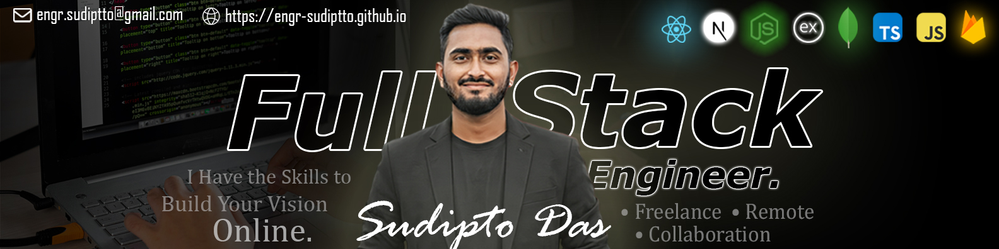

# Hi there! I am ***Sudipto Das***.

### ***Full Stack Engineer*** | React • Next.js • Node.js • Express.js • MongoDB • TypeScript • JavaScript

## About Me
I'm a Full Stack Engineer with hands-on experience building modern web applications from frontend interfaces to backend architecture.
 
 
My expertise includes developing scalable React and Next.js applications, designing REST APIs with Node.js and Express, managing databases with MongoDB and SQL, and integrating cloud-based solutions using Firebase.
 
 
I focus on writing clean, maintainable code and building products that deliver excellent user experiences while remaining scalable and performant.
 
 

## What I Build

🚀 SaaS Platforms 
🛒 E-commerce Applications 
📊 Dashboard & Admin Panels 
🌍 Business & Corporate Websites 
📱 Responsive Web Applications 
🔐 Authentication & Authorization Systems 
⚡ API Integration & Backend Services 
☁️ Cloud-based Applications 

## Featured Expertise
✔ Responsive Design 
✔ API Integration 
✔ Authentication Systems 
✔ CRUD Applications 
✔ REST API Development 
✔ Component Architecture 
✔ Performance Optimization 
✔ SEO Friendly Applications 
✔ Database Design 
✔ Clean Code Principles
 

## Tech Stack
#### Frontend:  

#### Styling: 

#### State Management: 

#### Backend:  

#### Database: 

#### Authentication & Cloud: 

#### Other Tools: 

 

## Current Learning Section: 
 
🌱 I'm currently learning ***“python”*** 

 

### Why My Tech Stack?
I choose the modern JavaScript ecosystem like React, Next.js, JS, and TypeScript because it offers the perfect balance of performance, maintainability, and future-proofing.
- **React & Next.js:** Allow me to build reusable component-based applications which is fast, highly interactive, SEO & user-friendly.
- **TypeScript:** It helps me write cleaner code with fewer bugs, making the application more stable and easier to update in the future.
- **Sass TailwindCSS & Bootstrap:** With Sass and Tailwind, I build beautiful designs quickly. They keep the code organized and light, making the website load faster and ensuring a seamless, high-performance user experience.
- **Redux & State Management:** It helps me manage complex application states predictably across components, ensuring smooth data flow and a glitch-free user experience.
- **Node.js & Express.js:** Enabling me to build fast, scalable, and asynchronous REST APIs on the backend, creating a unified full-stack JavaScript environment.
- **MongoDB:** A flexible, NoSQL database choice that allows rapid data mapping and seamless integration with my JavaScript backend for efficient data handling.
- **Firebase & Cloud Tools:** Used for secure user authentication, real-time database solutions, and quick cloud deployment without managing complex server infrastructures.
- **Python (Current Learning):** Expanding my horizons into scripting, automation, and data logic to write even more versatile and efficient backend systems.
 
 

## Available For
✔ Freelance Projects 
✔ Frontend Development 
✔ Full Stack Development 
✔ Website Redesign 
✔ React & Next.js Applications 
✔ Business Websites 

## 📫  Let's Connect
Connect with me on [LinkedIn](https://www.linkedin.com/in/engr-sudiptto/) for professional inquiries or reach out via [Email](mailto:engr.sudiptto@gmail.com) for any tech collaborations. 
📧 [engr.sudiptto@gmail.com](mailto:engr.sudiptto@gmail.com)  
💼 [LinkedIn](https://www.linkedin.com/in/engr-sudiptto/) 
🌐 [Portfolio](https://engr-sudiptto.github.io) 

 

 
 

<b>Sudipto Das</b> | Amplifying human capability and scaling innovation with the speed of AI.
